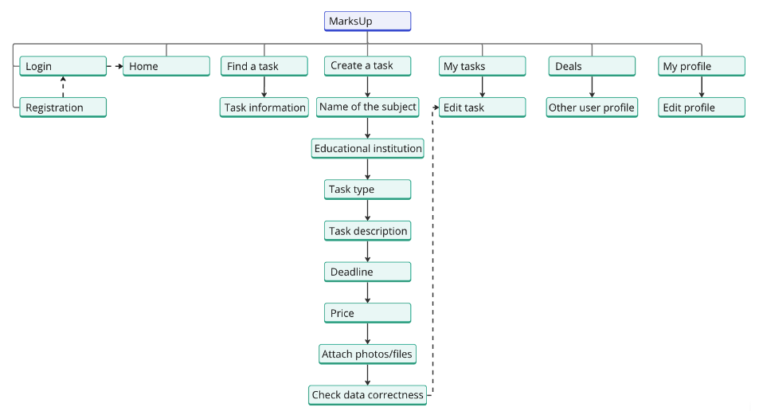

# MarksUp

## Project description

MarksUp is a freelance platform for educational assistance. Currently, educational programs are arranged in such a way that most of the materials must be studied, assimilated and worked out by students independently. In this regard, schoolchildren and students have difficulties in assimilating the knowledge provided, since not everyone can understand the materials on their own.
This service helps to find a partner / assistant for studying and working out educational materials.

On this website, a user can be a customer or an executor. Customers can create advertisements, and performers, in turn, find these ads, respond to them and provide help to the customer.

## Sitemap

Below is the Sitemap of the MarksUp website:

## Video demonstration

Demonstration of the website: https://youtu.be/F4sJHLaNciI

## Technical features

The front-end part of the website is written in pure HTML, CSS and JS.
The back-end part of the website is written in PHP.
PostgreSQL database is used for data storage.

The algorithmic features include password encryption using SHA-256.

## Website Link

Link: https://aquila-pay.ru/

Made by: Mikhail Uchunzhyan, Nikita Galkin.
All rights reserved, 2024.
